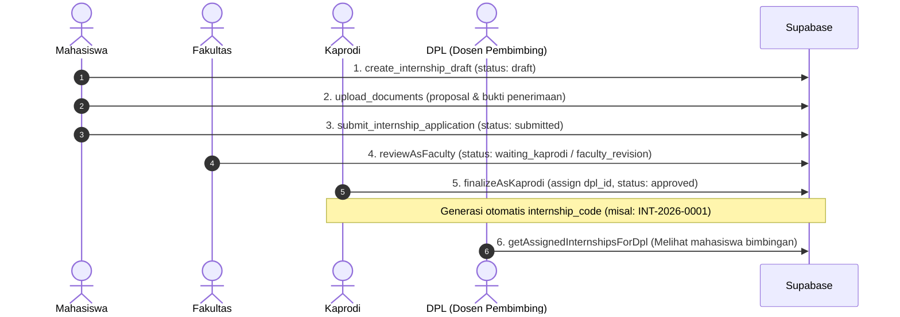

# 📋 EXPECTED INTERNSHIP APPLICATION FLOW
**Sistem Konversi Nilai Magang Berbasis OBE**

Dokumen ini menjelaskan spesifikasi alur pengajuan magang yang diharapkan oleh service backend. Tim pengembang SQL Migration & RLS harus memastikan bahwa trigger, status transition, dan kebijakan RLS mendukung alur berikut.

---

## 🔄 ALUR TAHAPAN PENGAJUAN MAGANG

---

## 📌 DETIL SETIAP TAHAP ALUR

### 1. Tahap Draft (`status: draft`)
- **Aktor**: Mahasiswa
- **Aksi**: 
  - Mahasiswa mengisikan formulir pendaftaran magang (Nama Perusahaan, Posisi, Durasi).
  - Mengunggah berkas proposal dan surat penerimaan industri ke bucket `internship-documents`.
- **Aturan Database**:
  - Mahasiswa hanya dapat mengedit aplikasi miliknya sendiri yang berstatus `draft` atau `faculty_revision` / `kaprodi_revision`.

### 2. Tahap Pengajuan (`status: submitted`)
- **Aktor**: Mahasiswa
- **Aksi**: Mahasiswa menekan tombol **Submit Pengajuan**.
- **Aturan Database**:
  - Mengubah status aplikasi dari `draft` menjadi `submitted`.
  - Mencatat timestamp `submitted_at`.
  - Mengunci aplikasi dari perubahan data formulir oleh mahasiswa.

### 3. Tahap Verifikasi Fakultas (`status: waiting_kaprodi` / `faculty_revision`)
- **Aktor**: Fakultas (Admin Fakultas)
- **Aksi**: 
  - Memeriksa kelengkapan administrasi dan berkas proposal.
  - Memilih keputusan: `approve` (lanjut ke Kaprodi) atau `revision` (dikembalikan ke mahasiswa).
- **Status Hasil**:
  - `approve` $\rightarrow$ `waiting_kaprodi`
  - `revision` $\rightarrow$ `faculty_revision`

### 4. Tahap Penetapan DPL & Finalisasi Kaprodi (`status: approved` / `kaprodi_revision`)
- **Aktor**: Kaprodi (Ketua Program Studi)
- **Aksi**: 
  - Mengulas aplikasi magang dan memilih Dosen Pembimbing Lapangan (DPL) dari direktori dosen.
  - Memilih keputusan: `approve` atau `revision`.
- **Status Hasil**:
  - `approve` $\rightarrow$ `approved`
  - `revision` $\rightarrow$ `kaprodi_revision`

### 5. Generasi Kode Magang (`internship_code`)
- **Aktor**: System Trigger / Database RPC
- **Aksi**: 
  - Ketika aplikasi magang mencapai status `approved`, sistem secara otomatis meregenerasi `internship_code` unik dengan format `INT-YYYY-XXXX` (contoh: `INT-2026-0001`).

### 6. Akses Bimbingan DPL
- **Aktor**: DPL
- **Aksi**: 
  - DPL yang ditugaskan (`dpl_id`) kini memiliki akses untuk melihat detail aplikasi magang mahasiswa bimbingannya pada dashboard DPL.

---

## 🛑 DAFTAR STATUS MAGANG (`internshipStatuses`)
- `draft`: Draft awal formulir mahasiswa.
- `submitted`: Menunggu verifikasi berkas oleh Fakultas.
- `faculty_revision`: Perlu perbaikan berkas oleh mahasiswa dari Fakultas.
- `waiting_kaprodi`: Menunggu penugasan DPL dan persetujuan Kaprodi.
- `kaprodi_revision`: Perlu perbaikan oleh mahasiswa dari Kaprodi.
- `approved`: Magang disetujui, DPL ditetapkan, dan `internship_code` terbit.
- `rejected`: Pengajuan magang ditolak.
