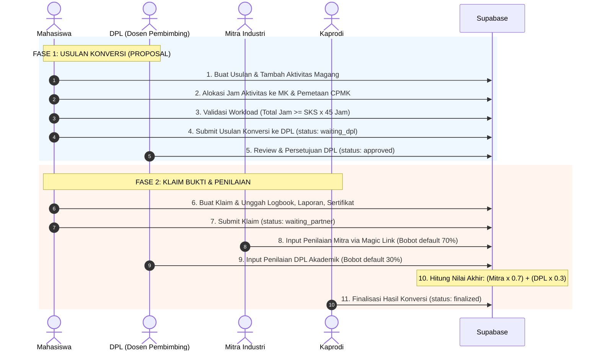

# 📊 EXPECTED OBE CONVERSION & ASSESSMENT FLOW
**Sistem Konversi Nilai Magang Berbasis Outcome-Based Education (OBE)**

Dokumen ini menjelaskan spesifikasi alur perencanaan usulan konversi, validasi beban jam (workload), klaim bukti, penilaian berbobot (Mitra 70% / DPL 30% atau dinamis), hingga finalisasi transkrip nilai.

---

## 🔄 ALUR TAHAPAN KONVERSI OBE

---

## 📌 DETIL TAHAPAN KONVERSI & FORMULA

### 1. Perencanaan Usulan & Pemetaan CPMK
- **Mahasiswa** mendaftarkan daftar rencana kegiatan magang pada `proposal_activities`.
- Mengalokasikan durasi jam kegiatan ke mata kuliah target pada `proposal_activity_courses`.
- Memetakan setiap kegiatan ke Capaian Pembelajaran Mata Kuliah (`proposal_activity_cpmks`).

### 2. Validasi Beban Jam Workload (Aturan 1 SKS = 45 Jam)
- **Standar OBE**: 1 SKS kegiatan magang setara dengan **45 jam beban kerja/workload**.
- **Rumus Validasi**:
  $$\text{Jam Wajib Minimal} = \text{Total SKS Mata Kuliah} \times 45 \text{ Jam}$$
  *Contoh*: Untuk mengkonversi 3 SKS MK, total alokasi jam kegiatan minimal **135 jam**.

### 3. Review Usulan oleh DPL
- **DPL** mengulas kecukupan jam dan kesesuaian CPMK usulan mahasiswa.
- Apabila sesuai, status usulan berubah menjadi `approved`.

### 4. Pelaksanaan & Pengajuan Klaim Bukti
- Setelah magang berakhir, **Mahasiswa** membuat klaim konversi (`conversion_claims`).
- Mengunggah 3 dokumen wajib ke storage:
  1. Logbook Kegiatan Mingguan (`logbook_url`)
  2. Laporan Akhir Magang (`report_url`)
  3. Sertifikat Industri (`certificate_url`)

### 5. Penilaian Berbobot (Mitra 70% & DPL 30%)
- **Penilaian Mitra (70%)**: Pembimbing Industri menilai performa teknis dan soft-skills mahasiswa melalui tautan penilaian khusus (tanpa perlu akun login).
- **Penilaian DPL (30%)**: DPL menilai laporan magang, penguasaan CPMK, dan sikap akademik mahasiswa.
- **Konfigurasi Dinamis**: Bobot 70/30 dapat disesuaikan oleh Kaprodi via database/RPC dan disimpan pada `final_conversion_results` agar histori konversi lama tidak berubah jika bobot diperbarui di masa depan.

### 6. Perhitungan Nilai Akhir & Konversi Grade Huruf
- **Rumus Perhitungan Nilai**:
  $$\text{Nilai Akhir} = \left( \text{Skor Mitra} \times \frac{\text{Bobot Mitra}}{100} \right) + \left( \text{Skor DPL} \times \frac{\text{Bobot DPL}}{100} \right)$$
  *Contoh (Skor Mitra: 90, Skor DPL: 85, Bobot: 70/30)*:
  $$\text{Nilai Akhir} = (90 \times 0.7) + (85 \times 0.3) = 63 + 25.5 = 88.5$$

- **Standar Konversi Grade Huruf**:
  - $\ge 80.00 \rightarrow \mathbf{A}$
  - $70.00 - 79.99 \rightarrow \mathbf{B}$
  - $60.00 - 69.99 \rightarrow \mathbf{C}$
  - $50.00 - 59.99 \rightarrow \mathbf{D}$
  - $< 50.00 \rightarrow \mathbf{E}$

### 7. Finalisasi oleh Kaprodi
- **Kaprodi** memverifikasi transkrip nilai konversi akhir dan menekan tombol **Finalisasi Transkrip**.
- Status klaim berubah menjadi `finalized` dan transkrip nilai dikunci secara permanen.
