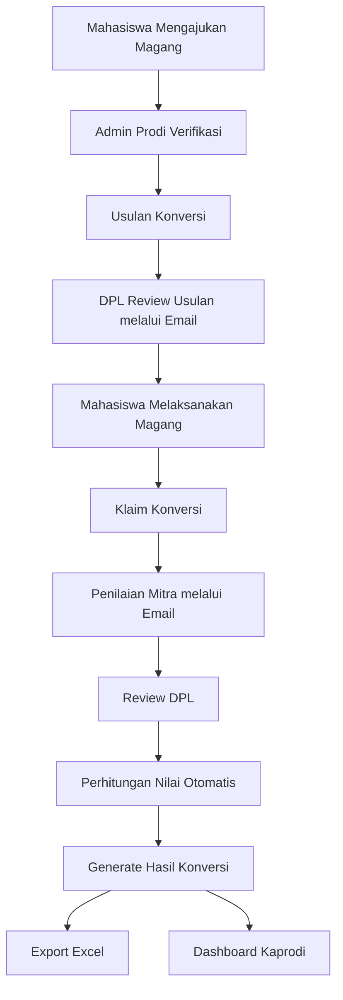

# Business Flow

# Sistem Konversi Nilai Magang Berbasis Outcome Based Education (OBE)

---

# Tujuan

Dokumen ini menjelaskan alur bisnis dari proses konversi magang mulai dari mahasiswa mengajukan magang hingga nilai konversi berhasil diterbitkan.

---

# Business Flow Overview



---

# Detail Business Flow

---

# 1. Pengajuan Magang

## Aktor

Mahasiswa

## Tujuan

Mahasiswa mengajukan kegiatan magang kepada Program Studi.

## Input

- NIM
- Nama
- Mitra Magang
- Posisi
- Periode
- DPL
- Proposal
- Surat Diterima

## Output

Status menjadi

```
Menunggu Verifikasi
```

---

# 2. Verifikasi Pengajuan

## Aktor

Admin Prodi

## Tujuan

Memastikan seluruh dokumen telah lengkap.

## Aksi

Admin dapat

- Approve
- Reject

Jika Approve

↓

Mahasiswa dapat melakukan Usulan Konversi.

Jika Reject

↓

Mahasiswa memperbaiki data.

---

# 3. Usulan Konversi

## Aktor

Mahasiswa

## Tujuan

Mahasiswa mengusulkan aktivitas magang yang akan dikonversi menjadi mata kuliah.

Mahasiswa melakukan mapping

```
Aktivitas Magang

↓

CPMK

↓

Mata Kuliah
```

Contoh

| Aktivitas | CPMK | Mata Kuliah |
|-----------|------|-------------|
| Membangun REST API | Mampu membangun aplikasi web | Pemrograman Web |

Status

```
Menunggu Persetujuan DPL
```

---

# 4. Approval Usulan oleh DPL

## Aktor

DPL

## Tujuan

Mengevaluasi apakah usulan konversi sudah sesuai.

Approval dilakukan melalui Email.

DPL tidak diwajibkan login.

Email berisi tombol

```
Review Usulan
```

DPL dapat memilih

- Setuju
- Revisi
- Tolak

Jika revisi

↓

Mahasiswa menerima notifikasi.

Jika disetujui

↓

Mahasiswa melanjutkan proses magang.

---

# 5. Pelaksanaan Magang

## Aktor

Mahasiswa

Mahasiswa melaksanakan kegiatan magang sesuai proposal.

Selama magang mahasiswa mengumpulkan

- Logbook
- Dokumentasi
- Source Code
- Sertifikat

Tahap ini tidak memerlukan approval.

---

# 6. Klaim Konversi

## Aktor

Mahasiswa

Setelah magang selesai mahasiswa mengajukan Klaim Konversi.

Mahasiswa wajib mengunggah

- Logbook
- Laporan
- Sertifikat
- Bukti Aktivitas

Opsional

- GitHub
- Deployment
- Screenshot

Status

```
Menunggu Penilaian Mitra
```

---

# 7. Penilaian Mitra

## Aktor

Supervisor

Supervisor menerima Email.

Tidak perlu Login.

Supervisor cukup membuka link.

Mengisi

- Nilai
- Komentar

Klik

```
Simpan Penilaian
```

Status berubah menjadi

```
Menunggu Review DPL
```

---

# 8. Review Klaim oleh DPL

## Aktor

DPL

DPL menerima Email.

DPL melihat

- Dokumen
- Nilai Mitra
- Bukti Aktivitas

DPL dapat

- Setuju
- Revisi
- Tolak

Jika Setuju

↓

Input Nilai DPL

Jika Revisi

↓

Mahasiswa memperbaiki dokumen.

Jika Tolak

↓

Proses selesai.

---

# 9. Perhitungan Nilai

Perhitungan dilakukan otomatis.

Formula

```
Nilai Akhir

=

70% × Nilai Mitra

+

30% × Nilai DPL
```

Contoh

Nilai Mitra

90

Nilai DPL

85

Hasil

```
88.5
```

---

# 10. Generate Hasil Konversi

Sistem menghasilkan

- Mata Kuliah
- SKS
- Nilai
- Nilai Huruf
- Riwayat CPMK
- Bukti Aktivitas

Semua data disimpan ke database.

---

# 11. Export Excel

Admin dapat mengunduh hasil konversi.

Format

| Kode MK | Mata Kuliah | NIM | Nama | Nilai Angka | Nilai Huruf |
|----------|-------------|-----|------|-------------|-------------|

---

# 12. Dashboard

Dashboard digunakan oleh

- Admin
- Kaprodi

Dashboard menampilkan

- Jumlah Mahasiswa Magang
- Jumlah Mitra
- Jumlah Pengajuan
- Jumlah Usulan
- Jumlah Klaim
- Jumlah Menunggu Approval
- Jumlah Selesai
- Statistik Per Semester
- Statistik Mitra
- Statistik Nilai

---

# Status Flow

| Tahap | Status |
|--------|--------|
| Pengajuan | Draft |
| Pengajuan | Menunggu Verifikasi |
| Pengajuan | Disetujui |
| Usulan | Menunggu Persetujuan DPL |
| Usulan | Disetujui |
| Klaim | Menunggu Penilaian Mitra |
| Klaim | Menunggu Review DPL |
| Klaim | Revisi |
| Klaim | Disetujui |
| Konversi | Selesai |

---

# Business Rules

## Pengajuan

- Proposal wajib diunggah.
- Surat diterima wajib diunggah.

## Usulan

- Minimal memiliki satu aktivitas.
- Aktivitas harus dipetakan ke CPMK.
- CPMK harus berasal dari mata kuliah yang tersedia.

## Klaim

- Logbook wajib.
- Laporan wajib.
- Sertifikat wajib.

## Penilaian

- Nilai Mitra 0–100.
- Nilai DPL 0–100.
- Nilai dihitung otomatis.

---

# Improvement dibanding BIMA

| BIMA | Sistem Baru |
|------|-------------|
| UX rumit | Wizard Step |
| Approval Login | Approval via Email |
| Konversi & Klaim membingungkan | Dipisahkan menjadi dua tahap |
| Tidak ada Dashboard | Dashboard Monitoring |
| Nilai manual | Nilai otomatis |
| Tidak ada Activity Log | Activity Log lengkap |
| Tidak ada Notification | Email & Notifikasi otomatis |
| Sinkronisasi sulit | Data terintegrasi dengan Supabase |

---

# Kesimpulan

Business Flow yang baru memisahkan proses **Usulan Konversi** dan **Klaim Konversi**, mempermudah proses approval tanpa login melalui email, mengotomatiskan perhitungan nilai, serta menyediakan dashboard monitoring sehingga proses konversi magang menjadi lebih sederhana, transparan, dan sesuai dengan prinsip Outcome Based Education (OBE).