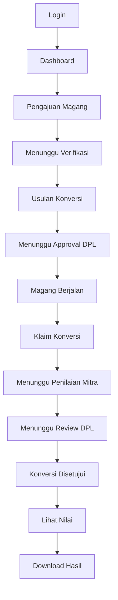
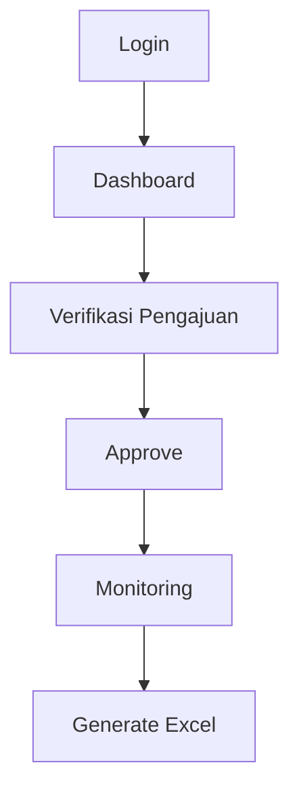
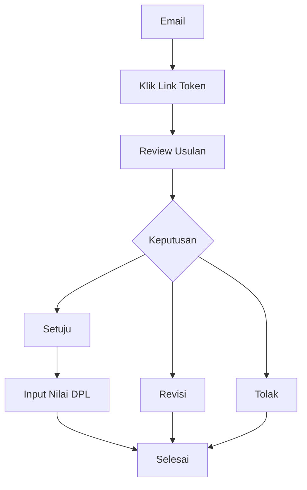
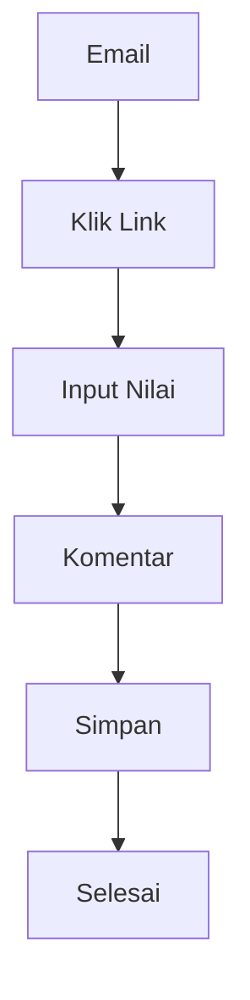
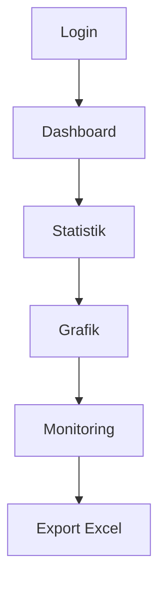

# User Flow

# Sistem Konversi Nilai Magang Berbasis Outcome-Based Education (OBE)

Version : 1.0

---

# Pendahuluan

Dokumen ini menjelaskan alur penggunaan sistem berdasarkan masing-masing aktor yang terlibat.

Setiap aktor memiliki hak akses, tujuan, dan alur kerja yang berbeda.

---

# Daftar Aktor

1. Mahasiswa
2. Admin Prodi
3. Dosen Pembimbing Lapangan (DPL)
4. Supervisor Mitra
5. Kaprodi

---

# 1. User Flow Mahasiswa

## Tujuan

Mahasiswa menggunakan sistem untuk:

- Mengajukan Magang
- Mengajukan Usulan Konversi
- Mengajukan Klaim Konversi
- Melihat Status
- Melihat Hasil Konversi

---

## Flow

---

## User Story

Sebagai mahasiswa,

Saya ingin dapat mengajukan magang,

Sehingga saya dapat mengikuti proses konversi mata kuliah.

---

Sebagai mahasiswa,

Saya ingin mengajukan Usulan Konversi,

Sehingga aktivitas magang dapat dipetakan ke CPMK.

---

Sebagai mahasiswa,

Saya ingin mengupload dokumen klaim,

Sehingga DPL dapat melakukan penilaian.

---

## Acceptance Criteria

✓ Proposal berhasil diupload.

✓ Surat diterima berhasil diupload.

✓ Status berubah otomatis.

✓ Notifikasi diterima.

✓ Dokumen tersimpan.

---

# 2. User Flow Admin Prodi

## Tujuan

Admin melakukan monitoring dan validasi.

---

## Flow

---

## User Story

Sebagai Admin,

Saya ingin memverifikasi pengajuan,

Sehingga hanya mahasiswa yang memenuhi syarat dapat melanjutkan proses.

---

Acceptance Criteria

✓ Data valid.

✓ Dokumen lengkap.

✓ Status berubah.

---

# 3. User Flow DPL

## Tujuan

DPL melakukan review tanpa login.

---

## Flow

---

## User Story

Sebagai DPL,

Saya ingin melakukan review melalui email,

Sehingga saya tidak perlu login ke sistem.

---

Acceptance Criteria

✓ Link aman.

✓ Token memiliki masa berlaku.

✓ Tidak perlu login.

✓ Review dapat dilakukan melalui HP.

---

# 4. User Flow Supervisor Mitra

## Tujuan

Supervisor memberikan nilai magang.

---

## Flow

---

## User Story

Sebagai Supervisor,

Saya ingin memberikan nilai tanpa login,

Sehingga proses penilaian menjadi cepat.

---

Acceptance Criteria

✓ Link dapat dibuka.

✓ Nilai tersimpan.

✓ Komentar tersimpan.

---

# 5. User Flow Kaprodi

## Tujuan

Kaprodi melakukan monitoring.

---

## Flow

---

## User Story

Sebagai Kaprodi,

Saya ingin melihat statistik magang,

Sehingga dapat memonitor pelaksanaan MBKM.

---

Acceptance Criteria

✓ Statistik tampil.

✓ Grafik tampil.

✓ Export berhasil.

---

# Hak Akses

| Fitur | Mahasiswa | Admin | DPL | Mitra | Kaprodi |
|---------|-----------|-------|-----|--------|----------|
| Dashboard | ✓ | ✓ | - | - | ✓ |
| Pengajuan Magang | ✓ | - | - | - | - |
| Verifikasi | - | ✓ | - | - | - |
| Usulan Konversi | ✓ | - | ✓ | - | - |
| Klaim Konversi | ✓ | - | ✓ | - | - |
| Penilaian Mitra | - | - | - | ✓ | - |
| Review DPL | - | - | ✓ | - | - |
| Dashboard Statistik | - | ✓ | - | - | ✓ |
| Export Excel | - | ✓ | - | - | ✓ |

---

# Notifikasi

Mahasiswa menerima notifikasi ketika:

- Pengajuan disetujui.
- Pengajuan ditolak.
- Usulan direvisi.
- Klaim direvisi.
- Penilaian selesai.
- Nilai diterbitkan.

---

DPL menerima notifikasi ketika:

- Ada Usulan Baru.
- Ada Klaim Baru.

---

Supervisor menerima notifikasi ketika:

- Mahasiswa meminta penilaian.

---

Admin menerima notifikasi ketika:

- Ada Pengajuan Baru.

---

# Kesimpulan

User Flow dirancang agar setiap aktor hanya melihat fitur yang sesuai dengan perannya. Proses approval untuk DPL dan Supervisor dilakukan melalui tautan email dengan token yang aman sehingga tidak memerlukan proses login. Pendekatan ini meningkatkan kemudahan penggunaan sekaligus memenuhi kebutuhan studi kasus hackathon.