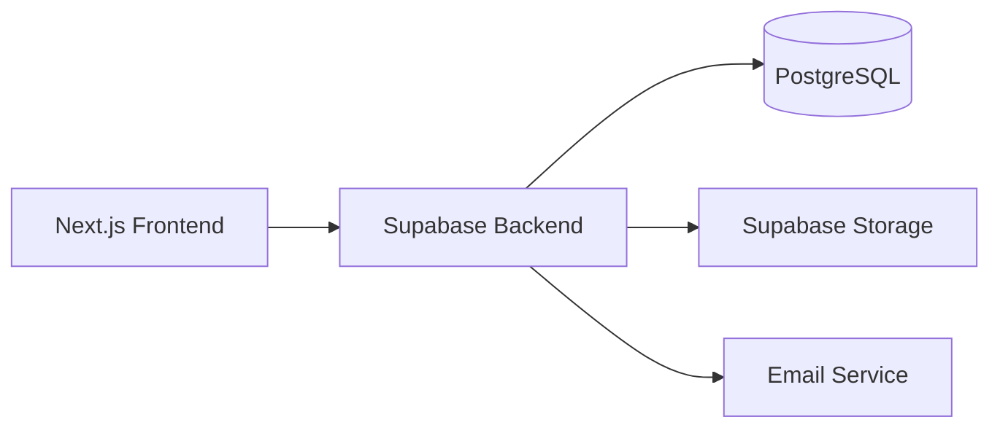

# API Documentation

# Sistem Konversi Nilai Magang Berbasis Outcome Based Education (OBE)

Version : 1.0

---

# Pendahuluan

Dokumen ini menjelaskan spesifikasi API yang digunakan pada Sistem Konversi Nilai Magang Berbasis Outcome Based Education (OBE).

Backend menggunakan Supabase sebagai Database dan Authentication.

Dokumen ini menjadi acuan Frontend agar tidak membuat endpoint baru yang tidak diperlukan.

---

# API Architecture



---

# Authentication

Authentication menggunakan Supabase Auth.

User login menggunakan email dan password.

Role yang tersedia

- Mahasiswa
- Admin Prodi
- DPL
- Kaprodi

Supervisor Mitra

Tidak memiliki akun.

Supervisor menggunakan Token Email.

---

# Response Format

Success

```json
{
    "success": true,
    "message": "Success",
    "data": {}
}
```

Error

```json
{
    "success": false,
    "message": "Validation Error"
}
```

---

# MODULE 1

## Authentication

### Login

POST

```
/auth/login
```

Request

```json
{
    "email":"user@email.com",
    "password":"password"
}
```

Response

```json
{
    "token":"JWT_TOKEN",
    "user":{
        "id":"uuid",
        "role":"mahasiswa"
    }
}
```

---

Logout

POST

```
/auth/logout
```

---

Get Profile

GET

```
/auth/profile
```

---

# MODULE 2

## Pengajuan Magang

### Membuat Pengajuan

POST

```
/internships
```

Body

```json
{
    "company_id":"uuid",
    "position":"Frontend Developer",
    "start_date":"2026-02-01",
    "end_date":"2026-06-01",
    "dpl_id":"uuid"
}
```

---

Ambil Semua Pengajuan

GET

```
/internships
```

---

Detail Pengajuan

GET

```
/internships/{id}
```

---

Update Pengajuan

PUT

```
/internships/{id}
```

---

Delete Pengajuan

DELETE

```
/internships/{id}
```

---

Approve Pengajuan

PATCH

```
/internships/{id}/approve
```

---

Reject Pengajuan

PATCH

```
/internships/{id}/reject
```

---

# MODULE 3

## Upload Dokumen Pengajuan

Upload Proposal

POST

```
/internships/{id}/proposal
```

---

Upload Surat Diterima

POST

```
/internships/{id}/acceptance
```

---

# MODULE 4

## Usulan Konversi

Create Proposal

POST

```
/conversion-proposals
```

Body

```json
{
    "internship_id":"uuid"
}
```

---

Tambah Mapping

POST

```
/proposal-details
```

Body

```json
{
    "proposal_id":"uuid",
    "activity":"Membangun REST API",
    "course_id":"uuid",
    "cpmk_id":"uuid"
}
```

---

Get Proposal

GET

```
/conversion-proposals
```

---

Detail Proposal

GET

```
/conversion-proposals/{id}
```

---

Approval DPL

PATCH

```
/conversion-proposals/{id}/approve
```

---

Revisi Proposal

PATCH

```
/conversion-proposals/{id}/revision
```

---

Reject Proposal

PATCH

```
/conversion-proposals/{id}/reject
```

---

# MODULE 5

## Laporan Bulanan

Tambah Laporan

POST

```
/monthly-reports
```

---

Daftar Laporan

GET

```
/monthly-reports
```

---

Review DPL

PATCH

```
/monthly-reports/{id}/review
```

---

# MODULE 6

## Klaim Konversi

Create Claim

POST

```
/claims
```

---

Detail Claim

GET

```
/claims/{id}
```

---

Upload Logbook

POST

```
/claims/{id}/logbook
```

---

Upload Laporan Akhir

POST

```
/claims/{id}/final-report
```

---

Upload Sertifikat

POST

```
/claims/{id}/certificate
```

---

Upload Dokumen Pendukung

POST

```
/claims/{id}/documents
```

---

# MODULE 7

## Penilaian Mitra

Generate Token

POST

```
/mentor-review/send-email
```

---

Review

GET

```
/mentor-review/{token}
```

---

Submit Nilai

POST

```
/mentor-review/{token}
```

Body

```json
{
    "score":90,
    "comment":"Mahasiswa sangat baik."
}
```

---

# MODULE 8

## Review DPL

Generate Email

POST

```
/dpl-review/send-email
```

---

Review

GET

```
/dpl-review/{token}
```

---

Approve

POST

```
/dpl-review/{token}
```

Body

```json
{
    "score":85,
    "status":"approved",
    "comment":"Laporan sudah sesuai."
}
```

Status

- approved
- revision
- rejected

---

# MODULE 9

## Finalisasi Kaprodi

Approve

POST

```
/kaprodi-review/{id}
```

---

Reject

POST

```
/kaprodi-review/{id}/reject
```

---

# MODULE 10

## Dashboard

Dashboard Admin

GET

```
/dashboard/admin
```

---

Dashboard Kaprodi

GET

```
/dashboard/kaprodi
```

---

Dashboard Mahasiswa

GET

```
/dashboard/student
```

---

# MODULE 11

## Notification

GET

```
/notifications
```

---

Read Notification

PATCH

```
/notifications/{id}
```

---

# MODULE 12

## Activity Log

GET

```
/activity-logs
```

---

# MODULE 13

## Export

Export Excel

GET

```
/exports/excel
```

---

Export PDF

GET

```
/exports/pdf
```

---

# Security

Semua endpoint menggunakan JWT Authentication kecuali endpoint berikut:

- /mentor-review/{token}
- /dpl-review/{token}

Kedua endpoint menggunakan Signed Token yang memiliki masa berlaku (expired).

---

# HTTP Status Code

| Code | Keterangan |
|------|------------|
|200|Success|
|201|Created|
|400|Bad Request|
|401|Unauthorized|
|403|Forbidden|
|404|Not Found|
|422|Validation Error|
|500|Internal Server Error|

---

# Catatan Implementasi

Backend sudah tersedia.

Dokumen ini digunakan sebagai acuan Frontend.

Apabila endpoint belum tersedia, gunakan Supabase RPC, Edge Function, atau API Route sesuai arsitektur proyek.

Jangan mengubah struktur database yang sudah ada kecuali diperlukan untuk memenuhi kebutuhan bisnis.