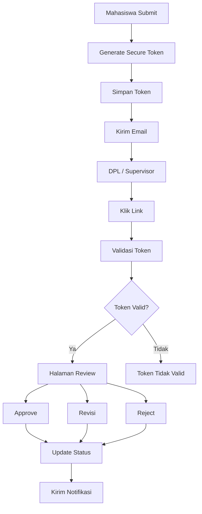

# Email Approval Documentation

# Sistem Konversi Nilai Magang Berbasis Outcome-Based Education (OBE)

Version : 1.0

---

# 1. Pendahuluan

Dokumen ini menjelaskan mekanisme approval melalui email yang digunakan oleh:

- Dosen Pembimbing Lapangan (DPL)
- Supervisor Mitra

Tujuan utama adalah agar proses review dan penilaian dapat dilakukan tanpa harus login ke dalam sistem.

Setiap email yang dikirim akan berisi tautan dengan token unik yang hanya berlaku dalam jangka waktu tertentu.

---

# 2. Tujuan

Approval melalui email bertujuan untuk:

- Mempermudah proses review.
- Mengurangi kebutuhan login.
- Mempercepat proses persetujuan.
- Meningkatkan pengalaman pengguna.
- Memastikan keamanan melalui token yang memiliki masa berlaku.

---

# 3. Alur Approval



---

# 4. Approval DPL

## Trigger

Mahasiswa mengirim:

- Usulan Konversi
- Laporan Bulanan
- Klaim Konversi

Sistem otomatis mengirim email kepada DPL.

---

## Email Berisi

- Nama Mahasiswa
- NIM
- Perusahaan
- Judul Magang
- Ringkasan Pengajuan
- Tombol Review

---

## Link

Contoh

```
https://domain.com/review/dpl/{token}
```

---

## Halaman Review

DPL dapat melihat:

- Data Mahasiswa
- Aktivitas Magang
- Mapping CPMK
- Dokumen
- Nilai Mitra (jika sudah ada)

---

DPL dapat memilih:

- Approve
- Revision
- Reject

---

Jika Approve

↓

Input Nilai DPL

↓

Submit

---

Jika Revision

↓

Isi komentar revisi

↓

Mahasiswa mendapat notifikasi

---

Jika Reject

↓

Isi alasan penolakan

↓

Status berubah menjadi Ditolak

---

# 5. Approval Supervisor Mitra

Supervisor menerima email setelah mahasiswa mengajukan Klaim Konversi.

Supervisor tidak perlu login.

---

Email berisi

- Nama Mahasiswa
- Posisi Magang
- Periode Magang
- Tombol Berikan Penilaian

---

Link

```
https://domain.com/review/mentor/{token}
```

---

Supervisor mengisi

- Nilai (0–100)
- Komentar

Klik

```
Simpan Penilaian
```

Status berubah menjadi

```
Menunggu Review DPL
```

---

# 6. Finalisasi Kaprodi

Setelah DPL menyetujui klaim dan memberikan nilai, sistem mengirim notifikasi kepada Kaprodi.

Kaprodi login ke sistem untuk melakukan:

- Final Review
- Approve
- Reject

Jika disetujui, sistem akan menghasilkan hasil konversi dan nilai akhir.

---

# 7. Token Security

Setiap email memiliki token unik.

Contoh

```
9d1bdb59-0d6b-4b0c-a36d-8f22d4d0f123
```

Token digunakan satu kali untuk satu proses review.

---

# 8. Masa Berlaku Token

Token memiliki batas waktu.

Misalnya:

- Berlaku selama 7 hari.
- Setelah kedaluwarsa, link tidak dapat digunakan.

Jika token sudah kedaluwarsa, pengguna akan melihat pesan:

```
Link penilaian telah kedaluwarsa.

Silakan hubungi Admin Prodi untuk mengirim ulang email.
```

---

# 9. Validasi Token

Sebelum halaman review ditampilkan, sistem memeriksa:

- Token tersedia.
- Token belum digunakan.
- Token belum kedaluwarsa.
- Token sesuai dengan jenis approval.

Jika salah satu validasi gagal, halaman review tidak dapat diakses.

---

# 10. Status Approval

## DPL

| Status | Keterangan |
|---------|------------|
| Pending | Menunggu Review |
| Approved | Disetujui |
| Revision | Perlu Perbaikan |
| Rejected | Ditolak |

---

## Supervisor

| Status | Keterangan |
|---------|------------|
| Pending | Belum Mengisi Nilai |
| Completed | Penilaian Selesai |

---

# 11. Notifikasi

Mahasiswa menerima notifikasi ketika:

- Usulan disetujui.
- Usulan direvisi.
- Usulan ditolak.
- Laporan bulanan direvisi.
- Penilaian Mitra selesai.
- Review DPL selesai.
- Konversi difinalisasi Kaprodi.

---

DPL menerima notifikasi ketika:

- Ada Usulan Konversi baru.
- Ada Laporan Bulanan baru.
- Ada Klaim Konversi baru.

---

Supervisor menerima email ketika:

- Ada permintaan penilaian.

---

Admin menerima notifikasi ketika:

- Ada pengajuan baru.
- Ada token yang gagal digunakan.
- Ada token yang kedaluwarsa.

---

# 12. Template Email DPL

Subject

```
Permintaan Review Usulan/Klaim Konversi Magang
```

Isi

```
Yth. Bapak/Ibu Dosen,

Mahasiswa berikut telah mengajukan proses yang memerlukan review.

Nama Mahasiswa : {{nama}}

NIM : {{nim}}

Perusahaan : {{company}}

Silakan klik tombol berikut untuk melakukan review.

[ Review Sekarang ]

Terima kasih.
```

---

# 13. Template Email Supervisor

Subject

```
Permintaan Penilaian Magang
```

Isi

```
Yth. Supervisor,

Mahasiswa berikut telah menyelesaikan kegiatan magang.

Nama : {{nama}}

Posisi : {{position}}

Silakan klik tombol berikut untuk memberikan penilaian.

[ Berikan Penilaian ]

Terima kasih.
```

---

# 14. Audit Log

Setiap aktivitas approval dicatat.

Contoh:

- Email dikirim.
- Link dibuka.
- Token divalidasi.
- Review dilakukan.
- Status diperbarui.
- Notifikasi dikirim.

---

# 15. Business Rules

- DPL tidak perlu login untuk review melalui email.
- Supervisor tidak perlu login untuk memberikan nilai.
- Token hanya dapat digunakan sesuai jenis approval.
- Token memiliki masa berlaku.
- Setelah review selesai, status pengajuan diperbarui secara otomatis.
- Semua aktivitas dicatat pada Activity Log.

---

# Kesimpulan

Mekanisme Email Approval dirancang untuk menyederhanakan proses review dan penilaian tanpa mengurangi aspek keamanan. Dengan penggunaan token yang aman, masa berlaku yang jelas, serta pencatatan seluruh aktivitas, proses approval menjadi lebih cepat, transparan, dan sesuai dengan kebutuhan Sistem Konversi Nilai Magang Berbasis Outcome-Based Education (OBE).