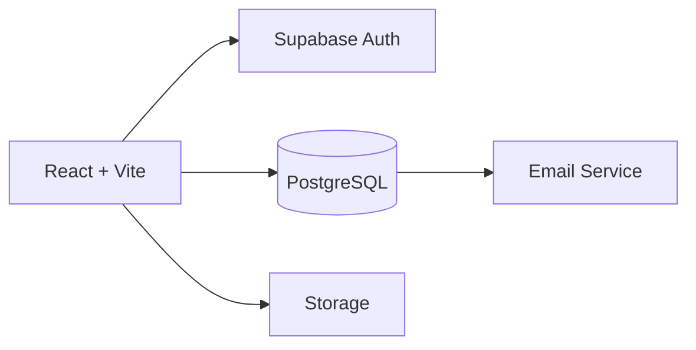
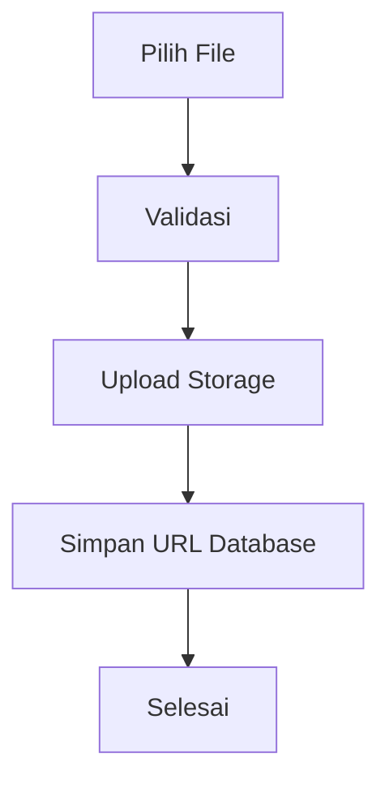
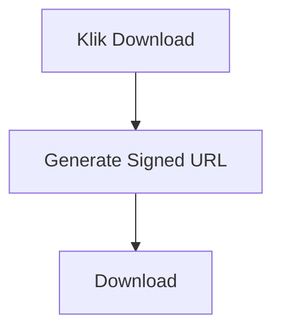

# Supabase Integration Documentation

# Sistem Konversi Nilai Magang Berbasis Outcome-Based Education (OBE)

Version : 1.0

---

# 1. Pendahuluan

Dokumen ini menjelaskan arsitektur integrasi antara aplikasi frontend React + Vite dengan layanan Supabase yang digunakan sebagai Backend-as-a-Service (BaaS).

Supabase digunakan sebagai penyedia:

- Authentication
- PostgreSQL Database
- Storage
- Realtime
- Edge Functions (Opsional)

Dokumen ini menjadi acuan agar frontend terhubung dengan backend yang telah tersedia tanpa mengubah struktur database.

---

# 2. Technology Stack

## Frontend

- React 19
- Vite
- TypeScript
- React Router DOM
- Tailwind CSS
- Shadcn UI
- Axios
- TanStack Query

---

## Backend

- Supabase

---

## Database

- PostgreSQL

---

## Storage

- Supabase Storage

---

## Authentication

- Supabase Auth

---

# 3. Arsitektur Sistem



---

# 4. Environment Variable

Gunakan file

```
.env
```

Contoh

```
VITE_SUPABASE_URL=https://your-project.supabase.co

VITE_SUPABASE_ANON_KEY=your_anon_key
```

Jangan menyimpan Service Role Key atau Secret Key di frontend.

---

# 5. Konfigurasi Client

File

```
src/lib/supabase.ts
```

Contoh

```ts
import { createClient } from "@supabase/supabase-js";

export const supabase = createClient(
    import.meta.env.VITE_SUPABASE_URL,
    import.meta.env.VITE_SUPABASE_ANON_KEY
);
```

---

# 6. Authentication

Login menggunakan Supabase Auth.

Role pengguna:

- Mahasiswa
- Admin Prodi
- DPL
- Kaprodi

Supervisor Mitra tidak memiliki akun.

Supervisor menggunakan Token Email.

---

# 7. Session

Session dikelola oleh Supabase Auth.

Saat login berhasil

↓

Access Token disimpan.

↓

Refresh Token otomatis.

↓

User tetap login.

---

# 8. Storage

Supabase Storage digunakan untuk menyimpan dokumen.

Bucket yang direkomendasikan

- proposals
- reports
- certificates
- logbooks
- claim-documents

Contoh struktur

```
proposals/

student-id/

proposal.pdf

reports/

student-id/

bulan-1.pdf

bulan-2.pdf

claim/

student-id/

certificate.pdf
```

---

# 9. Upload Flow



---

# 10. Download Flow



---

# 11. Bucket Access

Private Bucket

- Proposal
- Logbook
- Sertifikat
- Laporan

Public Bucket

Tidak direkomendasikan.

Semua dokumen sebaiknya bersifat private.

---

# 12. Row Level Security (RLS)

Aktifkan RLS pada seluruh tabel.

Contoh aturan

Mahasiswa

- Hanya dapat melihat data miliknya.

Admin

- Dapat melihat seluruh data.

DPL

- Hanya dapat melihat mahasiswa bimbingannya.

Kaprodi

- Dapat melihat seluruh data.

Supervisor

- Menggunakan Token Email.

Tidak menggunakan akun.

---

# 13. Realtime

Realtime digunakan untuk:

- Update Status
- Notifikasi
- Dashboard

Contoh

Mahasiswa submit

↓

Admin langsung melihat data baru

↓

Status berubah otomatis

---

# 14. Email Integration

Supabase digunakan untuk menyimpan data approval.

Email dikirim menggunakan layanan email (misalnya Resend).

Flow

Mahasiswa Submit

↓

Generate Token

↓

Simpan Token

↓

Kirim Email

↓

DPL

↓

Approve

↓

Update Database

↓

Notifikasi

---

# 15. Notification Flow

```mermaid
flowchart TD

Mahasiswa

↓

Submit

↓

Database

↓

Notification

↓

Frontend

↓

Toast

↓

Refresh Dashboard
```

---

# 16. Security

Semua endpoint harus menggunakan HTTPS.

Jangan menyimpan Secret Key di frontend.

Gunakan:

- JWT
- Signed URL
- Expired Token

---

# 17. Backup

Database

Backup Harian

Storage

Backup Mingguan

Activity Log

Tidak boleh dihapus.

---

# 18. Error Handling

Contoh

401

Unauthorized

↓

Redirect Login

404

Data Tidak Ditemukan

↓

Tampilkan Alert

500

Server Error

↓

Retry

---

# 19. Monitoring

Monitoring dilakukan melalui Dashboard Supabase.

Yang dipantau

- Authentication
- Database
- Storage
- API Usage
- Realtime
- Logs

---

# 20. Integrasi Frontend

Frontend menggunakan Service Layer.

Contoh struktur

```
src/

services/

auth.service.ts

internship.service.ts

proposal.service.ts

claim.service.ts

dashboard.service.ts

notification.service.ts
```

Setiap service bertanggung jawab melakukan komunikasi dengan Supabase atau API backend.

---

# 21. Integrasi dengan React Query

Disarankan menggunakan TanStack Query untuk:

- Fetch Data
- Cache
- Refetch Otomatis
- Loading State
- Error State

Hal ini akan meningkatkan performa aplikasi.

---

# 22. Business Rules

- Backend dan database yang sudah ada tidak diubah tanpa kebutuhan yang jelas.
- Frontend hanya mengonsumsi API atau layanan Supabase yang telah tersedia.
- Semua dokumen disimpan di Supabase Storage.
- Semua aktivitas penting dicatat pada Activity Log.
- Token email memiliki masa berlaku dan hanya dapat digunakan untuk proses review.

---

# 23. Kesimpulan

Supabase menjadi pusat layanan backend yang menangani autentikasi, database, penyimpanan dokumen, dan integrasi proses bisnis. Frontend React + Vite berkomunikasi dengan Supabase melalui service layer sehingga kode lebih terstruktur, mudah dipelihara, dan mendukung pengembangan aplikasi sesuai kebutuhan Sistem Konversi Nilai Magang Berbasis Outcome-Based Education (OBE).